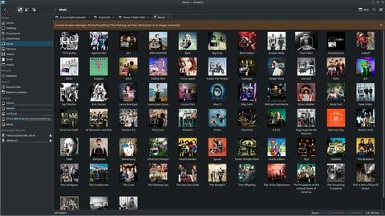

# Music Folder Utils (mfutil)

A comprehensive music library management tool for Linux desktops (GNOME/KDE). Organizes music files, extracts album art, creates symlinks, and syncs metadata with MusicBrainz.

 

Note: the project is implemented in Rust. Older references to a C program and `make` are outdated — use `cargo` to build and run.

## Features

- **Music Library Organization** - Automatically organizes music into `Artists/Artist/Album` structure
- **Album Art Integration** - Extracts embedded artwork and sets as folder icons
- **Smart Symlinks** - Creates `Albums/` and `Tracks/` directories with organized symlinks
- **Metadata Sync** - Updates all music metadata from MusicBrainz database
- **Import Management** - Import music from external directories with metadata validation
- **Reorganize** - Find and reorganize misplaced music files
- **Fast Processing** - Parallel processing for large music collections
- **Quality Control** - Validates metadata before importing, excludes files without proper tags

## Quick start

Build (debug):

```bash
cargo build
```

Build (release):

```bash
cargo build --release
```

Run (example):

```bash
cargo run --release -- all ~/Music
# or, run the built binary
./target/release/mfutil art ~/Music
```

Most commands default to `~/Music` if no path is supplied.

## Fast Builds with Just

For much faster builds, use **Just** - a modern command runner that provides significant performance improvements:

### Install Just
```bash
cargo install just
```

**Or from your distribution's package manager:**
```bash
# Arch Linux
sudo pacman -S just

# Debian/Ubuntu
sudo apt install just

# Fedora
sudo dnf install just

# macOS (Homebrew)
brew install just

# Alpine Linux
sudo apk add just
```

### Fast Build Commands
```bash
just dev           # Fastest development builds
just build         # Optimized release builds
just build-fast    # Fast release builds (no LTO)
just check         # Check without building
just test          # Run tests
```

### Installation Commands
```bash
just install-local     # Install for current user (~/.local/bin)
just install-system    # Install system-wide (/usr/local/bin) - requires sudo
just install-custom /path/to/dir  # Install to custom location
```

### Performance Benefits
- **Development builds**: 2-5x faster with incremental compilation
- **Release builds**: 1.5-3x faster with optimized settings
- **Fast builds**: 3-10x faster than standard release
- **Rebuilds**: 10-50x faster with build caching (sccache)
- **Linking**: 2-4x faster with lld linker

### Setup Build Tools (Optional)
```bash
just install-sccache    # Install build cache for massive rebuild speedups
just install-lld        # Install faster linker
just setup              # Install all build dependencies
```

### Build Performance Comparison
| Command | Description | Speed | Use Case |
|---------|-------------|-------|----------|
| `cargo build` | Standard dev build | Slow | Basic development |
| `just dev` | Optimized dev build | Fast | Fast development |
| `cargo build --release` | Standard release | Slow | Production |
| `just build` | Optimized release | Fast | Best optimization |
| `just build-fast` | Fast release | Fast | Development/CI |

**Example workflow:**
```bash
just check          # Quick error check
just dev            # Fast rebuild during development
just install-local  # Install for current user
./target/debug/mfutil organize ./testdata
```

## CLI subcommands

The binary exposes these subcommands (see `src/main.rs`):

- `all [music_dir]` — run sync, reorganize, import (with metadata validation), organize, create album and track symlinks
- `albums [music_dir]` — create symlinks for albums under `Albums/`
- `tracks [music_dir]` — create symlinks for tracks under `Tracks/`
- `sync [music_dir]` — query MusicBrainz and update all metadata tags (MusicBrainz Release IDs and other metadata)
- `art [music_dir]` — extract album/artist art and set folder icons
- `reorganize [music_dir]` — reorganize misplaced files to their proper artist/album structure based on metadata
- `import <import_path> [music_dir]` — import files from an external directory and organize them into the music library structure
- `organize [music_dir]` — organize music files within the music directory structure

### Examples

```bash
# Complete workflow - sync, reorganize, import, organize, and create symlinks
cargo run --release -- all ~/Music

# Sync metadata with MusicBrainz
cargo run --release -- sync ~/Music

# Import music from Downloads with metadata validation
cargo run --release -- import ~/Downloads/Music ~/Music

# Reorganize misplaced files
cargo run --release -- reorganize ~/Music

# Extract album art and set folder icons
cargo run --release -- art ~/Music

# Create album symlinks
cargo run --release -- albums ~/Music

# Create track symlinks
cargo run --release -- tracks ~/Music
```

## Project layout & important files

- `src/main.rs` — CLI parsing and orchestration using a small TUI helper
- `src/tui.rs` — `run_tui(title, total, closure, running_token)` progress helper (uses `mpsc::Sender<String>` to receive progress messages)
- `src/utils.rs` — filesystem helpers (expects a `~/Music/Artists` layout)
- `src/commands/` — per-feature modules:
  - `art.rs` — album/artist art extraction and folder icon management
  - `albums.rs` — album symlink creation and management
  - `tracks.rs` — track symlink creation and management
  - `sync.rs` — MusicBrainz metadata synchronization
  - `organize.rs` — music library organization, reorganization, and import functionality

## Enhanced Features

### Comprehensive Metadata Sync
- Updates all available metadata from MusicBrainz database
- MusicBrainz Release IDs, artist, album, release date, and track information
- Runs before import operations to ensure clean metadata

### Smart Import with Validation
- Import music from external directories (Downloads, Desktop, etc.)
- **Metadata validation** - Only imports files with proper artist/album information
- **Quality control** - Excludes files without sufficient metadata
- **Conflict prevention** - Won't overwrite existing organized files

### Intelligent Reorganization
- Finds and reorganizes misplaced music files
- Scans entire music directory for scattered audio files
- Automatically determines correct artist/album structure
- Preserves existing organized files

### Optimized Workflow
- **Proper ordering**: Sync → Reorganize → Import → Organize → Symlinks
- **Parallel processing** for large music collections
- **Progress tracking** with detailed status updates
- **Error handling** with graceful fallbacks

## System dependencies

The Rust crates wrap native libraries. On Debian/Ubuntu you will typically need:

```bash
sudo apt update
sudo apt install build-essential pkg-config libavformat-dev libavcodec-dev libavutil-dev libmagickwand-dev libglib2.0-dev libgirepository1.0-dev git
```

Also ensure `ffmpeg` is installed on the system (runtime) for tagging uncommon files and extracting attached pictures.

### Optional: Performance Tools

For significantly faster builds, install these optional tools:

#### sccache (Build Caching)
```bash
# Install sccache for 10-50x faster rebuilds
cargo install sccache

# Or from system packages
sudo apt install sccache    # Ubuntu/Debian
sudo pacman -S sccache      # Arch Linux and derivatives
sudo dnf install sccache    # Fedora and similar, package name may vary
```

#### lld (Faster Linker)
```bash
# Install lld for 2-4x faster linking
sudo apt install lld        # Ubuntu/Debian
sudo pacman -S lld          # Arch Linux and derivatives
sudo dnf install lld        # Fedora and similar, package name may vary
brew install llvm           # macOS
```

**With these tools installed:**
- `just dev` builds become 2-5x faster
- `just build-fast` provides 3-10x faster releases
- Rebuilds become 10-50x faster with caching

## Configuration: API keys

Two external APIs require keys if you want placeholder images or artist images fetched automatically:

- `PEXELS_API_KEY` — used to fetch placeholder images from Pexels for Artists/Albums/Tracks.
- `AUDIODB_API_KEY` — used to fetch artist thumbnails from TheAudioDB.

Set them in your shell before running the program, for example:

```bash
export PEXELS_API_KEY="your_pexels_api_key_here"
export AUDIODB_API_KEY="your_audiodb_api_key_here"
```

You can also set them via a .env file, the .env.example is available for reference.

**Free Tier API Keys:**
- AudioDB free tier key: `123`

if you are simply too lazy to get a pexels api key of your own, mine is below

```bash
PEXELS_API_KEY="563492ad6f91700001000001aacfd87a60cb4f369cb54d595b2f4142"
```

You should remove the quotes when pasting into your .env file.

If the variables are not set the program will skip those network calls and continue with local fallbacks.

## Enhanced Workflow

The `all` command provides a comprehensive music library management workflow:

```bash
cargo run --release -- all ~/Music
```

### Complete Workflow Steps:

1. **Sync** - Updates all metadata from MusicBrainz database
   - MusicBrainz Release IDs, artist, album, release date, track information
   - Runs first to ensure clean metadata for subsequent operations

2. **Reorganize** - Finds and reorganizes misplaced files
   - Scans entire music directory for scattered audio files
   - Moves files to proper `Artists/Artist/Album` structure
   - Preserves existing organized files

3. **Import** - Imports external files with metadata validation
   - Imports from Downloads, Desktop, or other external directories
   - **Validates metadata** - Only imports files with proper artist/album info
   - **Quality control** - Excludes files without sufficient metadata
   - **Conflict prevention** - Won't overwrite existing files

4. **Organize** - Organizes internal subfolders
   - Handles folders already within the music directory
   - Reorganizes complex nested structures
   - Ensures consistent `Artists/Artist/Album` layout

5. **Album Symlinks** - Creates organized album collection
   - Creates `Albums/` directory with symlinks to all albums
   - Provides flat view of entire music collection
   - Optimized for media players and browsing

6. **Track Symlinks** - Creates organized track collection
   - Creates `Tracks/` directory with symlinks to all tracks
   - Provides flat view of all individual tracks
   - Perfect for shuffle playback and track discovery

### Individual Commands

For more control, use individual commands:

```bash
# Sync only
cargo run --release -- sync ~/Music

# Import with validation
cargo run --release -- import ~/Downloads ~/Music

# Reorganize misplaced files
cargo run --release -- reorganize ~/Music

# Extract art and set icons
cargo run --release -- art ~/Music
```

### Skip Options

The `all` command supports skipping specific steps:

```bash
# Skip sync and art processing
cargo run --release -- all ~/Music --skip sync,art

# Skip reorganize step
cargo run --release -- all ~/Music --skip reorganize

# Skip import step
cargo run --release -- all ~/Music --skip import
```

## Security / configuration

- `src/commands/art.rs` currently contains hard-coded API keys (`PEXELS_API_KEY`, `AUDIODB_API_KEY`) — these are secrets. Replace them with environment variables before using in production. If you change the mechanism, update all call sites that expect those constants.

## Debugging

Enable backtraces:

```bash
RUST_BACKTRACE=1 cargo run -- <subcommand>
```

## Manual Pages

Comprehensive manual pages are available in the `man/` directory:

- `mfutil.1` - Main program manual
- `mfutil-art.1` - Album art extraction and management
- `mfutil-albums.1` - Album symlink creation
- `mfutil-tracks.1` - Track symlink creation
- `mfutil-sync.1` - MusicBrainz metadata synchronization
- `mfutil-reorganize.1` - File reorganization
- `mfutil-import.1` - Music import functionality
- `mfutil-cd.1` - CD ripping (requires cd-ripping feature)
- `mfutil-all.1` - Complete workflow automation

To install manpages system-wide:
```bash
sudo cp man/*.1 /usr/local/share/man/man1/
sudo mandb
```

Then view with: `man mfutil`, `man mfutil-art`, etc.

## License

This project is licensed under the GNU General Public License v3.0 - see the [LICENSE](LICENSE) file for details.
